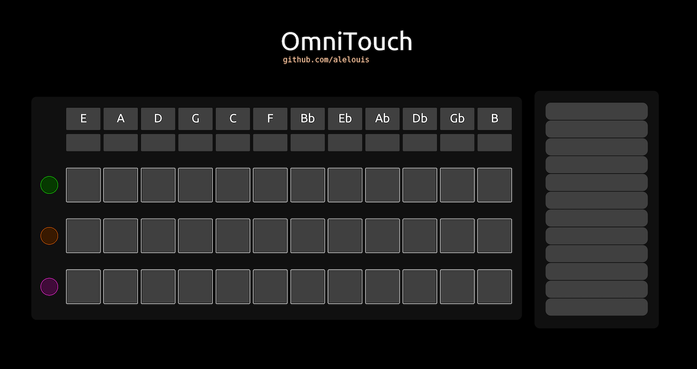

## OmniTouch

OmniTouch is a custom instrument for [TouchOSC](https://hexler.net/touchosc) that replicates partially a [Suzuki Omnichord](https://en.wikipedia.org/wiki/Omnichord).
Main differences are :

- All 12 chords in circle of fifths order (instead of 9 on the original)
- Only strumming mode

The **first row** is used to trigger major chords, strum on the right for arpeggios.
The **second row** is used to trigger minor chords, strum on the right for arpeggios.
The **third row** is used to trigger major/minor seventh chords, depending on what is chosen above.

### Demo

🖼 **Screenshot of interface**



🎥 **Video with Ableton Live and iPad**

[OmniTouch | Demo - YouTube](https://youtu.be/4TTwVh1yVVE)


*using TouchOSC for iOS, [protokol](https://hexler.net/protokol) for midi logging debug.*

### Usage

Download `omnitouch.osc` and import it in TouchOSC. As it uses multitouch, ensure you have a tactile screen or use a tablet.

**Make sure TouchOSC is linked to you TouchOSC bridge for midi forwarding.**

⚠️ If you encounter latency, check for network issues or bridge via USB.

### Customisation

The main script logic can be found under the strumming elements. The script is replicated in `logic.lua`.

You can modify the intervals order in order to create new chords.

```lua
  chords_offsets = {
  {0, 4, 7, 12, 16, 19, 24, 28, 31, 36, 40, 43}, 
  {0, 3, 7, 12, 15, 19, 24, 27, 31, 36, 39, 43}, 
  {0, 4, 7, 11, 12, 16, 19, 23, 24, 28, 31, 35}, 
  {0, 3, 7, 10, 12, 15, 19, 22, 24, 27, 31, 34}}
```

Also, you can choose the origin and/or ordering of the tonic notes.

```lua
  note_codes = {
  52 + offset, 
  57 + offset,
  50+ offset,
  55 + offset,
  48 + offset,
  53 + offset,
  46 + offset,
  51 + offset,
  44 + offset,
  49 + offset,
  42 + offset,
  47 + offset
  }
```

### Dependencies

`TouchOSC` [`touchosc`](https://hexler.net/touchosc) 
`TouchOSC Bridge` [`touchosc-bridge`](https://hexler.net/touchosc/bridge-releases) 